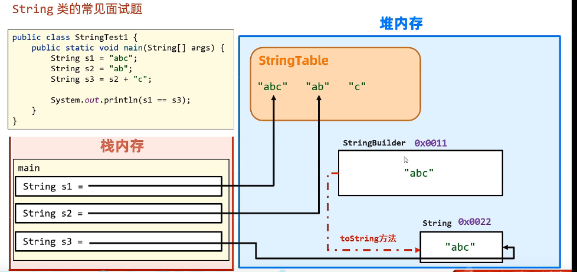
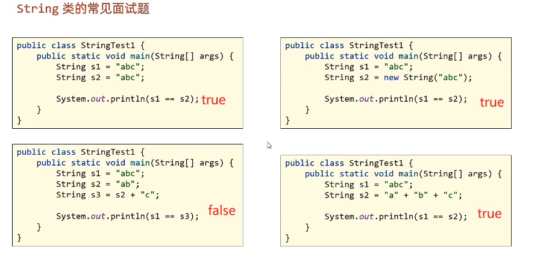

[toc]

# String

1. java中所有双引号字符串都是String的实例

2. 字符串一旦被创建，就无法被更改

>注意，此处的不能更改的意思是遍历所指向的地址的值无法更改，但是作为一个引用变量，该变量是可以被重新赋值的；
>
>也就是说，String的实例无法用str[index] = 'v'修改，但是可以赋值一个新的String类，即str = "value"

3. String对象虽然不能被修改，但是可以共享

   双引号创建新字符串对象时，会先检查常量池是否存在该数据，存在则直接复用，不存在则创建

   > JDK7之前，常量池是放在方法区，JDK7即之后就放进了堆

4. 字符串的拼接细节

   

​	+拼接，会先创建一个StringBuilder对象，将变量与字符串拼接，再用toString方法返回，所以不会去读常量区

5. 常量优化机制（第四题）

   