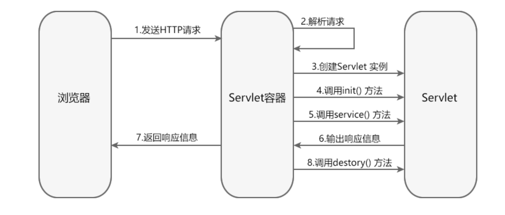
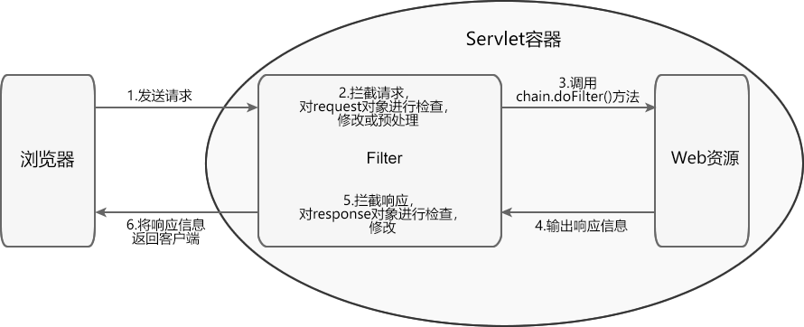

# Servlet

## 简介

servlet是运行在web服务器上的程序，介于HttpClient和服务器之间。

作为第一代Java Web开发技术，其实是对Java API的一层封装。

使用Servlet开发动态网页，是以字符串的形式输出HTML代码，十分繁琐，于是就有了JSP。

## Servlet容器

web服务器，如Apache、Nginx、IIS等，只能提供http服务，也就是静态资源

动态网页需要runtime+数据库+web服务器


而JRE不包含Servlet运行规范，所以需要额外的部件，这就是Servlet容器。

一个动态页面对应一个 Servlet 类，开发一个动态页面就是编写一个 Servlet 类，当用户请求到达时，Servlet 容器会根据配置文件（web.xml）来决定调用哪个类。

## Servlet的创建方式

三种方式：


逐层封装，GenericServlet是实现了Servlet接口的抽象类，HttpServlet是其子类（同样是作为抽象类），MyServlet程序是一个实现了Servlet接口的Java类

- Servlet中的定义了五种方法，实现接口需要重写这五个方法
- GenericServlet重写了Servlet中除了service中的其他四个方法，所以继承该类只需要重写service方法
- HttpServlet用于实现基于Http协议的Servlet程序，定义了HTTP1.1定义的其中请求方法，继承时可只重写对应需要的方法，比如doGet、doPost方法

## JSP

JSP相当于是在servlet上再做一层封装，它依赖于servlet，JSP代码会被翻译成servlet代码，再输出HTML字符

JSP允许HTML分离开来，也能在HTML页面中插入JSP代码

## Applet

与servlet相对的，servlet是服务端小程序，而applet是客户端小程序，运行在支持java的浏览器中，嵌入到HTML页面中。【目前已被Javascript完全取代】

## 虚拟路径映射

包括单一映射和多重映射

- 单一映射，其实就是单一路径映射到单个Servlet程序
- 多重映射，就是多个路径映射到一个Servlet程序

二者都有两种方式实现：①web.xml；②WebServlet注解

## @WebServlet注解

其实是对web.xml的简化，避免冗长、难维护的xml文件，业务解耦

写在每一个实例化的Servlet对象前，示例代码如下：

```java
@WebServlet(asyncSupported = true, name = "myServlet", description = "name描述", loadOnStartup = 1, urlPatterns = {
        "/MyServlet", "/*" }, initParams = {
                @WebInitParam(name = "编程帮", value = "www.biancheng.net", description = "init参数1"),
                @WebInitParam(name = "京东", value = "www.jd.com", description = "init参数2") })
```

## 生命周期

init()、service()、destroy()



## 虚拟路径映射

- 单一映射

  可以web.xml中的servlet-mapping标签中设置，也可以在@Webservlet注解中设置

- 多重映射

  多个servlet-mapping标签，or @Webservlet注解中设置数组

## 请求转发

1. 请求转发

   request和response都有Dispatcher接口

   ```java
   request.getRequestDispatcher("/DoServlet").forward(request, response);
   ```

2. 请求包含

   ```java
   .include(); // 包含
   ```

## Servlet重定向

```java
response.sendRedirect("/responseDemo/RefreshServlet");
```

重定向的请求处理中可以使用`getServletContext`来`setAttribute`存入，之后在下一个servlet类中使用`getAttribute`获取

## ServletContext接口

每一个web应用启动时，都会创建一个唯一的ServletContext对象

生命周期从容器启动到关闭或应用卸载时结束。

web应用中的所有Servlet程序共享一个ServletContext对象，借此可以实现**数据通讯**

ServletContext对象也被称为**Context域对象**

作用：

- Servlet程序间的数据通信

- 获取上下文的初始化参数

- 读取 Web 应用下的资源文件（比如配置文件和日志文件等）

  > ```java
  > InputStream ins = getServletContext().getResourceAsStream("/WEB-INF/classes/db.properties");
  > ```
  >
  > 可以从以上方法获取Context并使用getResourceAsStream方法获取文件的输入流对象

## ServletConfig接口

为每一个Servlet程序创建的存储初始化参数信息的对象，（注意：级别是Servlet程序）

## HttpServletRequest接口


> Servlet 容器接收到来自客户端的 HTTP 请求后，容器会针对该请求分别创建一个 HttpServletRequest 对象和 HttpServletReponse 对象。

- HttpServletRequest 对象用于封装 HTTP 请求信息（**请求行信息、请求头信息、form表单信息**）


## HttpServletResponse接口

- HttpServletReponse 对象用于封装 HTTP 响应信息（**响应行、响应头、响应体**）


## 会话技术

由于HTTP是无状态的协议，需要会话技术来存储会话期间的用户信息

对事物的处理没有记忆能力，每次请求都是独立的，无法保存用户状态信息

- Cookie，客户端会话技术

> 两种：一种是保存在浏览器内存中，关闭浏览器则失效；一种是持久的Cookie，以文本形式保存在硬盘上

> 缺点：
>
> 在HTTP请求中，明文传递，不安全
>
> 浏览器可以禁用Cookie，一旦被禁用，将无法工作
>
> Cookie对象只能设置文本（字符串）信息
>
> 客户端浏览器保存Cookie的数量和长度都是有限的（单个Cookie不超过4K）

- Session，服务端会话技术

  

  > 当客户端第一次请求会话对象时，服务器会创建一个Session对象，并为之分配一个唯一的SessionID

  > 每个浏览器都独占一个Session，一个浏览器不同窗口可以共享一个Session

## Session和Cookie的区别

| 不同点                 | Cookie                                                       | Session                                                      |
| ---------------------- | ------------------------------------------------------------ | ------------------------------------------------------------ |
| 存储位置不同           | Cookie 将数据存放在**客户端**浏览器内存中或硬盘上。          | Session 将数据存储在**服务器端**。                           |
| 大小和数量限制不同     | 浏览器对 Cookie 的大小和数量有限制。                         | Session 的大小和数量一般不受限制。                           |
| 存放数据类型不同       | Cookie 中保存的是字符串。                                    | Session 中保存的是对象。                                     |
| 安全性不同             | Cookie 明文传递，安全性低，他人可以分析存放在本地的 Cookie 并进行 Cookie 欺骗。 | Session 存在服务器端，安全性较高。                           |
| 对服务器造成的压力不同 | Cookie 保存在客户端，不占用服务器资源。                      | Session 保存在服务端，每一个用户独占一个 Session。若并发访问的用户十分多，就会占用大量服务端资源。 |
| 跨域支持上不同         | Cookie 支持跨域名访问。                                      | Session 不支持跨域名访问。                                   |

## Servlet三大域对象

Session 、request 以及 ServletContext 合称为 Servlet 的三大域对象

## Servlet Filter（过滤器）

能对request对象和response对象进行检查和修改

> - 在 Web 资源被访问前，检查 request 对象，**修改请求头和请求正文**，或对请求进行预处理操作。
> - 将请求传递到下一个过滤器或目标资源。
> - 在 Web 资源被访问后，检查 response 对象，
> - 在 Web 资源被访问前，检查 request 对象，修改请求头和请求正文，或对请求进行预处理操作。
> - 将请求传递到下一个过滤器或目标资源。
> - 在 Web 资源被访问后，检查 response 对象，**修改响应头和响应正文**



两种方式进行配置：①web.xml；②@WebFilter注解配置

```java
@WebFilter(urlPatterns = "/aa/*",servletNames = "Servlet2")
public class FirstFilter implements Filter {
    @Override
    public void init(FilterConfig filterConfig) {
        System.out.println("init");
    }

    @Override
    public void doFilter(ServletRequest request, ServletResponse response, FilterChain chain) throws IOException, ServletException {
        System.out.println("放行前");
        HttpServletRequest httpServletRequest= (HttpServletRequest) request;
        //获取当前请求的URL
        System.out.println(httpServletRequest.getRequestURL());
        //放行，调用下一个过滤器或者访问资源
        chain.doFilter(request, response);
        System.out.println("放行后");
    }

    @Override
    public void destroy() {
        System.out.println("destroy");
    }
}
```

## 监听器（Listener）

分成三类：

1. 监听对象创建和销毁的监听器
2. 监听对象中属性变更的监听器
3. 监听HttpSession中的对象状态改变的监听器

有8个监听器接口，可以用于监听 ServletContext、HttpSession 和 ServletRequest 对象的生命周期和属性变化事件

- 监听器的注册

  > 注册 Servlet 监听器有 2 种方式，分别是：
  >
  > 1. 在 web.xml 中注册监听器；
  > 2. 使用 @WebListener 注册监听器。
