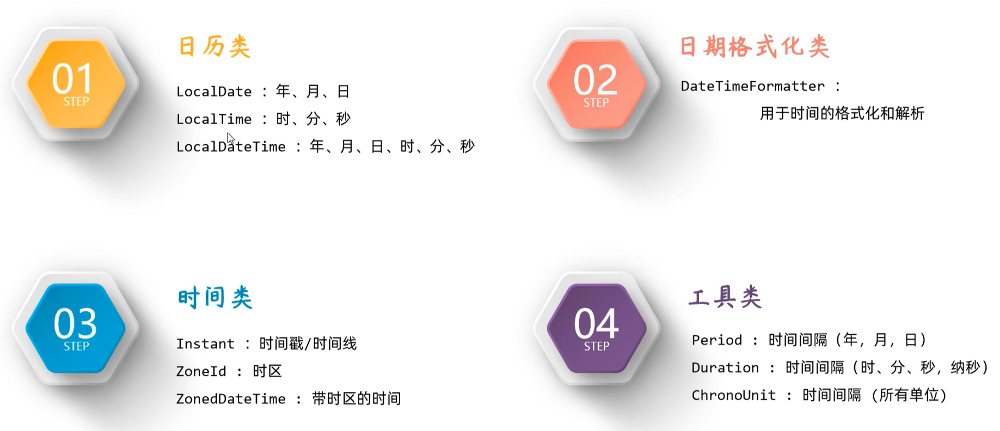

[toc]

# JDK8开始的时间API

## 日历类

- LocalDate，日期——年月日周
- LocalTime，时间——时分秒 纳秒
- LocalDateTime，上俩相加

| 方法 | 说明 |
| ---- | ---- |
| now  | 获取 |
| of   | 设置 |

## 格式化

- DateTimeFormatter

| 方法      | 说明       |
| --------- | ---------- |
| ofPattern | 格式化形式 |
| format    | 格式化方法 |
|           |            |

解析：parse

用日历类，调用parse方法
