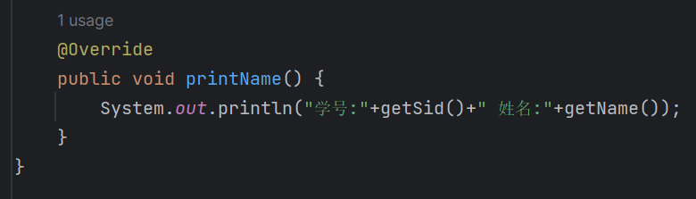
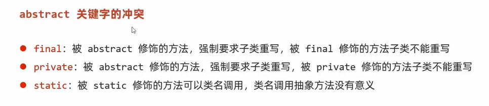

[toc]

# 抽象类

## 抽象类

- 抽象类不能实例化，注：抽象方法不能被调用

- 存在构造方法，存在的意义：交给子类super调用

- 可以存在普通方法

- 抽象类的子类，也就是说抽象类也是可以继承实现

  > 抽象类可以继承普通类，也可以继承抽象类（需要重写所有抽象方法）
  >
  > 抽象类继承抽象类，可以不用重写抽象方法

父类中无法描述清楚具体方法，定义为抽象方法，抽象方法只能定义在抽象类中

## 抽象方法

子类需要重写所有抽象方法

## abstract

