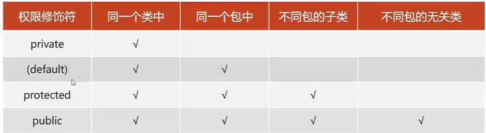

[toc]

# 继承

## 父子关系

类与类之间产生继承关系，子类可以直接使用父类中的非私有成员

提高代码复用性

## 关键字

this指向对象

super指向父类

## 重载与重写

方法重载（overload）：在统一个类中，方法名相同，参数不同，与返回值无关

> 参数不同：类型不同、个数不同、顺序不同

方法重写（override）：在子父类中，出现了方法声明一摸一样的方法（方法名，参数，返回值）

> 重写父类方法时，访问权限必须大于等于父类

## 继承特点

java支持单继承，不支持多继承，但是支持多层继承

## 构造方法

子类的构造方法中，都隐藏一个super()，自动调用父类的空参构造方法