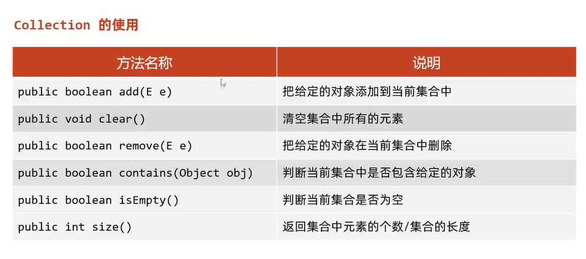
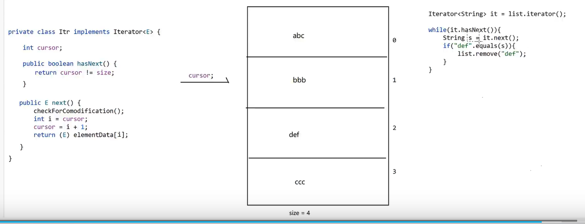
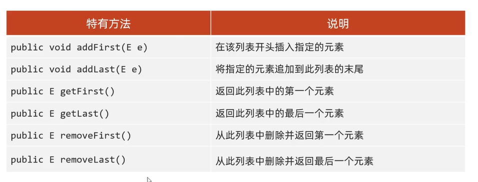

[toc]

# 集合

## 单列集合

都实现了Collection接口

### Collection接口



注意：`remove`的时候，如果元素类型是对象类型，则需要重写对象的equals方法

#### Collection遍历

##### 迭代器

```java
Iterator<Student> itr = c.iterator();

while(itr.hasNext()) {
  Student s = itr.next();
  System.out.println(s);
}
```


##### 增强for循环

底层也是迭代器

```java
for (Student student : c) {
           //  
        }
```

##### foreach

底层也是迭代器

```java
c.forEach(new Consumer<Student>() {
            @Override
            public void accept(Student student) {
                System.out.println(student);
            }
        });
```


### List接口

存储有序、有索引、可以重复

```java
public static void main(String[] args) {
        List<String> list = new ArrayList<>();

        list.add("q");
        list.add("h");

        list.add(0, "0");
        list.set(0, "0-set");
        list.remove(1); // List接口的remove方法

        System.out.println(list);

        String s = list.get(0);
        System.out.println(s);
    }
```

##### 遍历方法

除了集合的方法和普通for，还有ListIterator

```java
// 正序遍历
        ListIterator<String> li = list.listIterator();
        while(li.hasNext()) {
            System.out.println(li.next());
        }

        System.out.println("--------------------");
        // 倒序遍历
        while(li.hasPrevious()) {
            System.out.println(li.previous());
        }
```

！注意，使用迭代器遍历集合过程中，调用了【集合对象】的增、删，会报错“并发修改异常”，可以使用迭代器自身的add（List迭代器特有）、remove方法。

！但删除倒数第二个不会报错（代码check执行逻辑）



- ArrayList（数组列表）

  底层是基于数组实现的，查询元素快，增删慢

- LinkedList（链表）

  底层是基于双链表实现，查询元素慢，增删首尾元素快

  

### Set接口

存取无序、没有索引、不可重复

- TreeSet
- HashSet
- LinkedHashSet

## 双列集合

- TreeMap
- HashMap
- LinkedHashMap